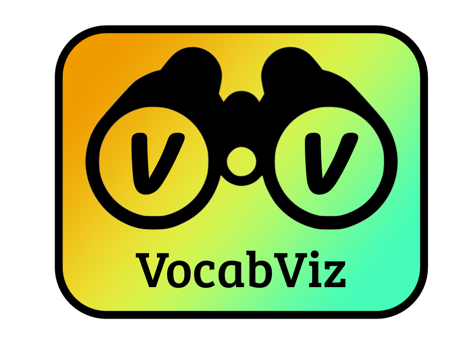

# Vocab Viz

Learning new language vocabulary through an interactive AR experience.

## See It In Action
[](https://www.youtube.com/watch?v=15p8nqRELFA)

## Team

* **Hector Castillo** - *MIT '20* | Integration, Infrastructure
* **Evan Hostetler** - *MIT '22* | Hardware Specialist, Branding
* **Anthony Nardomarino** - *MIT '22* | Object Classification Specialist
* **Tony Terrasa** - *MIT '21* | AR Specialist, Integration
* **Grady Thomas** - *MIT '23* | Translation API Specialist

## About US

The Vocab Viz team is comprised of five undergraduate students studying mechanical and aerospace engineering at MIT. At Vocab Viz we are driven not only to help the world learn new languages, but to bring the world a little closer together. 

## Built With

* [IBM Visual Recognition](https://cloud.ibm.com/catalog/services/visual-recognition)
* [Google Cloud Translation API](https://cloud.google.com/translate/?utm_source=google&utm_medium=cpc&utm_campaign=na-US-all-en-dr-bkws-all-all-trial-e-dr-1007179&utm_content=text-ad-none-any-DEV_c-CRE_297670894993-ADGP_Hybrid+%7C+AW+SEM+%7C+BKWS+%7C+US+%7C+en+%7C+EXA+~+ML/AI+~+Translation+API+~+google+cloud+translate-KWID_43700037004364741-kwd-166600839370&utm_term=KW_google%20cloud%20translate-ST_google+cloud+translate&gclid=Cj0KCQjwn_LrBRD4ARIsAFEQFKue6OWXW_-XTgIPRACTeE5FLx12wreHO63RJapJ-rZMMRt2lUtndhgaAvfXEALw_wcB)
* [OpenCV - Object Tracking and I/O](https://https://opencv.org/)


## Dependencies
The following will be necessary to run VocabViz

- Python2.7
- Pillow==6.1.0
- OpenCV-Contrib==3.4.4
- Numpy==1.16.5
- ibm-watson==3.4.0
- google-cloud-translate==1.6.0

```
  pip install opencv-contrib-python==3.4.4.19  
  pip install pillow
  pip install numpy
  pip install ibm_watson
  pip install --upgrade google-cloud-translate
```

In order to run the google translate, you need the private key to access Google Cloud Services. Download your key and make sure the following environment variable is set:
```
  export GOOGLE_APPLICATION_CREDENTIALS="/path/to/key"
```


